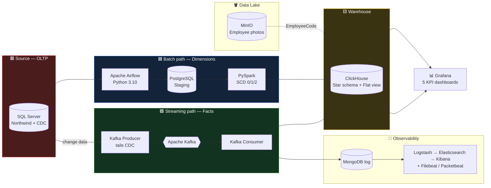

<h1 align="center">🌪️ Northwind Real-Time Data Warehouse</h1>

  <b>A legacy SSIS batch pipeline, re-imagined as a fully containerized, near-real-time data platform.</b> 
  From a change in the source database to a moving number on a dashboard — in <b>seconds</b>, not overnight.

  
  
  
  
  
  
  

---

## 📖 The Story

The original teaching model was a classic Microsoft BI stack: **SQL Server → SSIS packages → SQL Server DW**, scheduled through SQL Server Agent jobs. It worked — but it was **batch-only**. Every change to the business waited hours for the next job to run before it showed up in reporting.

This project rebuilds that same idea on a **modern, open-source, containerized data stack** and removes the time-lag entirely. Dimensions still refresh in disciplined nightly batches, but **facts now stream in near-real-time** through Change Data Capture and Kafka. The whole platform stands up with Docker and is version-controlled end to end.

The dataset is the well-known **Northwind** sample (customers, orders, products, employees, shippers, territories).

---

## 🏗️ Architecture

Everything runs in one **Docker Compose** project on an isolated network.

---

## ✨ What it does

- **Captures every change** to the source (insert / update / delete) on `Orders` and `Order Details` via SQL Server **CDC**, tracked with LSN watermarks.
- **Loads dimensions** the right way with **Slowly Changing Dimensions** — Type 0 (fixed), Type 1 (overwrite), and Type 2 (full history with `is_current` + start/end dates) — computed in **PySpark** on a real Spark cluster.
- **Streams facts in near-real-time**: a Python producer tails CDC and publishes to **Kafka**; a consumer writes to **ClickHouse** in **~2–6 seconds** end to end.
- **Serves analytics** through five single-screen **Grafana** dashboards, plus a live operations monitor.
- **Stores unstructured data in a lakehouse pattern**: employee photos live in **MinIO** object storage; the warehouse keeps only the `EmployeeCode → URL` metadata.
- **Monitors itself**: every streamed event is logged to **MongoDB** and shipped through **Logstash → Elasticsearch → Kibana**, with Filebeat and Packetbeat for logs and network flow.

---

## 🧩 Tech stack

| Layer | Technology |
|---|---|
| Source (OLTP) | SQL Server 2022 · Change Data Capture |
| Orchestration | Apache Airflow (Python 3.10) |
| Transformation | Apache Spark / PySpark |
| Staging | PostgreSQL |
| Data Warehouse | ClickHouse (ReplacingMergeTree, star + flat view) |
| Streaming | Apache Kafka |
| Data Lake | MinIO (S3-compatible) |
| Observability | MongoDB · Elasticsearch · Logstash · Kibana · Filebeat · Packetbeat |
| Visualization | Grafana |
| Platform | Docker · Docker Compose · Git |

---

## 🧠 The hard problems it solves

- **Master/Detail fan-out** — an order-header change correctly propagates to *every* line of that order, not just one.
- **Self-referencing employee hierarchy** — `DimEmployees` resolves the "reports-to" chain (the real Northwind org chart) via a two-pass parent-key load.
- **Inferred members** — a fact that arrives before its dimension gets a placeholder row that later self-heals.
- **Delete semantics in a columnar store** — handled with a versioned `ReplacingMergeTree` and an `is_deleted` flag.
- **Two watermarks, no double-processing** — the batch and streaming paths track LSNs independently.

---

## 📊 Dashboards

Five purpose-built, single-screen KPI pages (no scrolling, no duplicated metrics):

1. **Executive Overview** — headline KPIs, revenue trend, seasonality.
2. **Product & Category** — revenue share (donut), top products, discount gauges, a rich comparison table.
3. **Customer & Geography** — a world map, top customers, regional breakdowns.
4. **Sales Team & Fulfillment** — performance by employee and shipper, on-time shipping.
5. **Real-Time Operations** — live ingest rate, latency, and the last orders as they stream in.

Plus an **Employee Directory** showcasing the data-lake pattern with real employee photos served from MinIO.

> _Screenshots in [`/docs/screenshots`](docs/screenshots)._

---

## ✅ Validated against ground truth

The pipeline's output matches the canonical Northwind figures exactly:

| Metric | Value |
|---|---|
| Total revenue | **$1,265,793.04** |
| Total freight | **$64,942.69** |
| Orders | 830 |
| Order lines | 2,155 |
| Products | 77 · Customers | 89 · Employees | 9 |

---

## 👤 Author

Built as a final data-engineering project.
�ℹ️ Repo: **northwind-data-engineering**

<i>Change something in the source. Watch the dashboard move. That's the whole point.</i>

